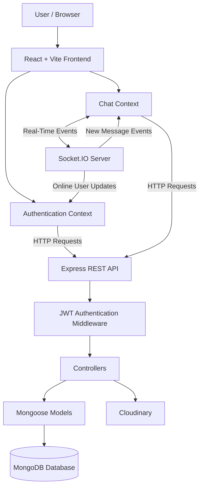
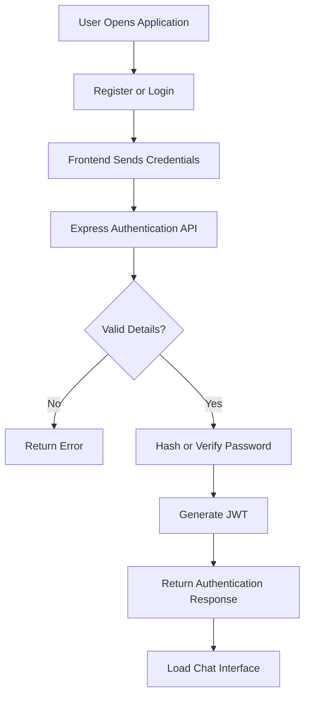
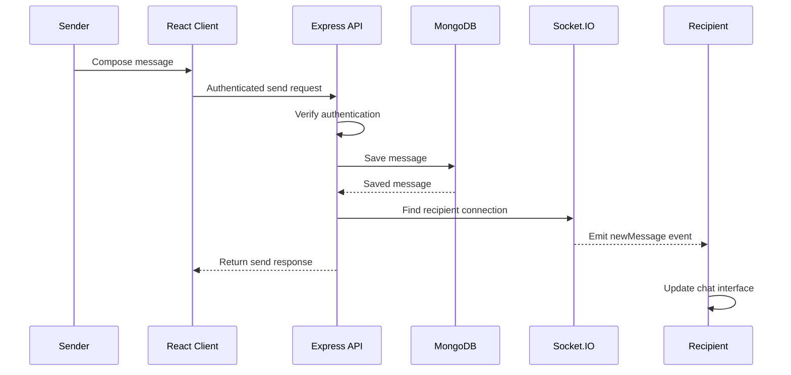
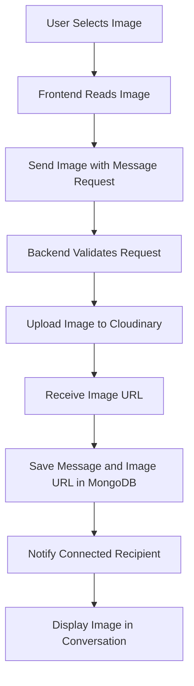
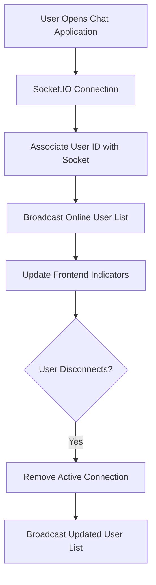

# Quick Chat App — Real-Time Messaging Platform

<p align="center">
  A modern, full-stack messaging application built for seamless one-to-one conversations, real-time online presence, and image sharing.
</p>

<p align="center">
  <strong>🌐 Live Demo: <a href="https://thetachat.com">https://thetachat.com</a></strong>
</p>

<p align="center">
  
  
  
  
  
  
  
</p>

---

## 📌 Table of Contents

- [Project Overview](#-project-overview)
- [Problem Statement](#-problem-statement)
- [Project Objectives](#-project-objectives)
- [Live Demo](#-live-demo)
- [Key Features](#-key-features)
- [Technology Stack](#-technology-stack)
- [System Architecture](#️-system-architecture)
- [Application Workflow](#-application-workflow)
- [Project Structure](#-project-structure)
- [Database Design](#️-database-design)
- [API Documentation](#-api-documentation)
- [Installation and Setup](#️-installation-and-setup)
- [Environment Variables](#-environment-variables)
- [Deployment](#-deployment)
- [Engineering Highlights](#-engineering-highlights)
- [Security Considerations](#-security-considerations)
- [Testing Checklist](#-testing-checklist)
- [Challenges and Learning Outcomes](#-challenges-and-learning-outcomes)
- [Future Improvements](#-future-improvements)
- [Contributing](#-contributing)
- [Author](#️-author)
- [License](#-license)

---

## 🚀 Project Overview

**Quick Chat App** is a full-stack, real-time messaging application designed to provide users with a simple, interactive, and responsive communication experience.

The application enables users to create accounts, authenticate securely, discover other registered users, exchange messages in real time, share images, and manage their profiles.

The frontend is developed using React and Vite, while the backend uses Node.js and Express.js. MongoDB provides persistent data storage, Socket.IO enables real-time communication, and Cloudinary handles image hosting.

The project demonstrates practical software engineering concepts, including REST API development, authentication, database modeling, event-driven communication, third-party service integration, and full-stack deployment.

### 🎯 Problem Statement

Modern messaging applications need reliable communication, efficient message handling, and a responsive user experience.

This project addresses several common requirements:

- Users need a simple way to create accounts and access conversations.
- Messages should appear without manually refreshing the application.
- Users need visibility into which contacts are currently online.
- Conversation history should remain available after navigating away from a chat.
- Users should be able to exchange images in addition to text.
- Profile information should be manageable through the application interface.

Quick Chat App brings these capabilities together in a single web application.

### 💡 Project Objectives

The primary objectives are to:

1. Build a responsive messaging interface using React.
2. Develop REST APIs using Node.js and Express.js.
3. Implement user authentication using JSON Web Tokens (JWT).
4. Protect passwords through hashing with bcrypt.
5. Store user and message data in MongoDB.
6. Implement real-time messaging using Socket.IO.
7. Track connected users and display online status.
8. Support image sharing using Cloudinary.
9. Provide profile management and unread-message indicators.
10. Deploy the application so users can access it through a live website.

---

## 🌐 Live Demo

**Try Quick Chat App:** [https://thetachat.com](https://thetachat.com)

Open the live application to explore its interface and test the available features.

For a complete messaging demonstration, use two separate test accounts in different browser sessions, where account access is available.

---

## ✨ Key Features

### 1. User Authentication

- User registration and login.
- Password hashing using `bcryptjs`.
- JWT-based authentication.
- Protected API routes using authentication middleware.
- Authenticated-user verification.
- Logout functionality.

### 2. Real-Time Messaging

- Send text messages to other registered users.
- Receive new messages through Socket.IO events.
- Retrieve previous conversation messages from MongoDB.
- Persist messages for later retrieval.
- Display messages in the conversation interface.
- Support image messages.

### 3. Online User Presence

- Track connected users through Socket.IO.
- Display online indicators in the user list.
- Show the selected user's online status.
- Update the connected-user list when users connect or disconnect.

### 4. Image Sharing

- Upload and send images within conversations.
- Store uploaded images using Cloudinary.
- Save image URLs with their corresponding messages.
- Display shared images in conversations.
- View images associated with the selected conversation.

### 5. Profile Management

- Update the user's display name.
- Edit profile bio information.
- Upload or change the profile picture.
- Display profile details in the chat interface.

### 6. User Search and Chat Navigation

- View registered users in the sidebar.
- Search users by name.
- Select a user to open a conversation.
- Navigate between conversations through the chat list.

### 7. Unread Message Tracking

- Maintain unread-message counts for users.
- Display unread counts in the sidebar.
- Mark received messages as seen when a conversation is opened.

### 8. Responsive User Interface

- Component-based React architecture.
- Dedicated login, home, profile, and chat components.
- Conversation sidebar and user-details panel.
- Interactive controls and toast notifications.
- Responsive styling using Tailwind CSS.

---

## 🧰 Technology Stack

| Technology | Purpose |
|---|---|
| React | Building reusable and interactive UI components |
| Vite | Frontend development server and production build |
| Tailwind CSS | Responsive styling and layout |
| React Router | Client-side navigation |
| React Context API | Shared authentication and chat state |
| Axios | HTTP communication between frontend and backend |
| React Hot Toast | Success and error notifications |
| Node.js | Server-side JavaScript runtime |
| Express.js | REST API and request handling |
| MongoDB | Persistent storage for users and messages |
| Mongoose | Database schemas and MongoDB operations |
| Socket.IO | Real-time message delivery and online presence |
| JSON Web Token | Authentication tokens |
| bcryptjs | Password hashing and password comparison |
| Cloudinary | Image hosting and media uploads |
| dotenv | Environment variable configuration |
| CORS | Cross-origin request configuration |

---

## 🏗️ System Architecture

Quick Chat App follows a **client-server architecture** with REST APIs for application operations and Socket.IO for real-time communication.

### High-Level Architecture



### Architecture Components

**1. Frontend — React**

Responsible for rendering the user interface, handling user interactions, managing application state, and displaying messages.

**2. API Communication — Axios**

Sends requests to the Express backend for authentication, profile updates, user lists, and message operations.

**3. Backend — Node.js and Express**

Processes incoming requests, validates authentication, executes application logic, and coordinates database operations.

**4. Authentication Middleware**

Verifies JWTs for protected routes and identifies the authenticated user.

**5. Database Layer — MongoDB and Mongoose**

Stores user information and messages using defined schemas and models.

**6. Real-Time Layer — Socket.IO**

Maintains client connections, tracks online users, and delivers new-message events to connected recipients.

**7. Media Storage — Cloudinary**

Stores uploaded images and provides URLs that can be referenced by the application.

---

## 🔄 Application Workflow

### 1. User Registration and Login



**Workflow explanation:**

1. A user submits registration or login details.
2. The frontend sends the information to the backend.
3. During registration, the password is hashed before storage.
4. During login, the password is compared with the stored hash.
5. A successful login returns an authentication token.
6. The client uses authentication for protected operations.
7. The application loads the user's chat interface.

### 2. Real-Time Message Flow



**Workflow explanation:**

1. The sender selects a recipient and enters a message.
2. The frontend sends an authenticated request to the backend.
3. The backend validates the request and identifies the sender.
4. The message is saved in MongoDB.
5. The backend checks whether the recipient has an active Socket.IO connection.
6. If connected, the recipient receives a `newMessage` event.
7. The frontend updates the conversation interface.

### 3. Image Upload Flow



### 4. Online Presence Flow



---

## 📁 Project Structure

The project is organized into separate frontend and backend directories.

```text
Chat_App-main/
│
├── client/
│   ├── public/
│   │
│   ├── context/
│   │   ├── AuthContext.jsx
│   │   └── ChatContext.jsx
│   │
│   ├── src/
│   │   ├── assets/
│   │   ├── components/
│   │   │   ├── ChatContainer.jsx
│   │   │   ├── RightSidebar.jsx
│   │   │   └── Sidebar.jsx
│   │   │
│   │   ├── lib/
│   │   │   └── utils.js
│   │   │
│   │   ├── pages/
│   │   │   ├── HomePage.jsx
│   │   │   ├── LoginPage.jsx
│   │   │   └── ProfilePage.jsx
│   │   │
│   │   ├── App.jsx
│   │   ├── main.jsx
│   │   └── index.css
│   │
│   ├── .env
│   ├── package.json
│   └── vite.config.js
│
├── server/
│   ├── controllers/
│   │   ├── messageController.js
│   │   └── userController.js
│   │
│   ├── lib/
│   │   ├── cloudinary.js
│   │   ├── db.js
│   │   └── utils.js
│   │
│   ├── middleware/
│   │   └── auth.js
│   │
│   ├── models/
│   │   ├── Message.js
│   │   └── User.js
│   │
│   ├── routes/
│   │   ├── messageRoutes.js
│   │   └── userRoutes.js
│   │
│   ├── .env
│   ├── package.json
│   └── server.js
│
└── README.md
```

*Note: This is the documented project structure. Check it against your actual repository and update filenames or directories if your code uses a different structure.*

### Frontend Responsibilities

| File | Responsibility |
|---|---|
| `App.jsx` | Main application structure and routes |
| `main.jsx` | React entry point |
| `AuthContext.jsx` | Authentication state and online-user information |
| `ChatContext.jsx` | Chat list, selected conversation, and message state |
| `ChatContainer.jsx` | Message display, text input, and image sending |
| `Sidebar.jsx` | User list, search, unread counts, and navigation |
| `RightSidebar.jsx` | Selected user's profile information and shared images |
| `HomePage.jsx` | Main application page |
| `LoginPage.jsx` | Login and registration interface |
| `ProfilePage.jsx` | Profile editing interface |
| `vite.config.js` | Vite configuration |

### Backend Responsibilities

| File | Responsibility |
|---|---|
| `server.js` | Express application, Socket.IO initialization, and server startup |
| `userRoutes.js` | Authentication and profile API routes |
| `messageRoutes.js` | User-list and messaging API routes |
| `userController.js` | Signup, login, authentication checks, and profile updates |
| `messageController.js` | Message retrieval, sending, unread counts, and seen status |
| `auth.js` | Authentication middleware |
| `User.js` | User schema and model |
| `Message.js` | Message schema and model |
| `db.js` | MongoDB connection |
| `cloudinary.js` | Cloudinary configuration |
| `utils.js` | Shared backend utilities |

---

## 🗄️ Database Design

Quick Chat App uses MongoDB with Mongoose to model application data.

### 1. User Collection

The user model represents registered users.

| Field | Purpose |
|---|---|
| `_id` | Unique user identifier generated by MongoDB |
| `fullName` | User's display name |
| `email` | User's email address |
| `password` | Hashed password |
| `profilePic` | Profile image URL |
| `bio` | User profile description |

### 2. Message Collection

The message model represents individual messages exchanged between users.

| Field | Purpose |
|---|---|
| `_id` | Unique message identifier |
| `senderId` | Reference to the sender |
| `receiverId` | Reference to the recipient |
| `text` | Text message content |
| `image` | Image URL when the message includes an image |
| `seen` | Indicates whether the message has been seen |
| `createdAt` | Message creation timestamp |
| `updatedAt` | Last update timestamp |

*The exact stored fields and timestamp behavior depend on the schema definition in the source code.*

### Database Relationships

- One user can send multiple messages.
- One user can receive multiple messages.
- Each message references its sender and recipient.
- Image messages reference image URLs hosted by Cloudinary.
- The `seen` field supports unread-message tracking.

---

## 🔌 API Documentation

The backend exposes REST API endpoints for authentication, profile management, user discovery, and messaging.

### Authentication and User APIs

| Method | Endpoint | Description | Access |
|---|---|---|---|
| `POST` | `/api/users/signup` | Register a new user | Public |
| `POST` | `/api/users/login` | Authenticate an existing user | Public |
| `GET` | `/api/users/check` | Verify the authenticated user | Protected |
| `PUT` | `/api/users/update-profile` | Update profile details and picture | Protected |

### Messaging APIs

| Method | Endpoint | Description | Access |
|---|---|---|---|
| `GET` | `/api/messages/users` | Retrieve chat users and unread counts | Protected |
| `GET` | `/api/messages/:id` | Retrieve messages for a selected conversation | Protected |
| `PUT` | `/api/messages/mark/:id` | Mark a message as seen | Protected |
| `POST` | `/api/messages/send/:id` | Send a text or image message | Protected |

### Status API

| Method | Endpoint | Description |
|---|---|---|
| `GET` | `/api/status` | Return a basic server status response |

### API Notes

- Protected endpoints require valid authentication.
- The frontend should use the correct deployed backend URL.
- Request bodies and response formats should be checked against the relevant controllers.
- Socket.IO events handle real-time updates separately from ordinary REST responses.

*Verify these endpoint paths and HTTP methods against your actual route files before publishing the documentation.*

---

## ⚙️ Installation and Setup

Follow these steps to run Quick Chat App locally.

### Prerequisites

Install the following:

- Node.js (LTS recommended)
- npm
- MongoDB or a MongoDB Atlas account
- Cloudinary account for image uploads
- Git

### Step 1: Clone the Repository

```bash
git clone <YOUR_GITHUB_REPOSITORY_URL>
cd Chat_App-main
```

Replace `<YOUR_GITHUB_REPOSITORY_URL>` with your actual GitHub repository URL. Update the directory name if your cloned repository uses a different name.

### Step 2: Install Backend Dependencies

```bash
cd server
npm install
```

### Step 3: Configure the Backend Environment

Create a `.env` file inside the `server` directory.

```env
MONGODB_URI=your_mongodb_connection_string
FRONTEND_URL=http://localhost:5173
JWT_SECRET=your_long_random_secret
PORT=5000
```

Add the Cloudinary environment variables required by your `server/lib/cloudinary.js` configuration.

**Important:** Use the exact variable names read by your source code and hosting configuration. Never place real credentials in this README.

### Step 4: Start the Backend

Use the command defined by your backend `package.json`. For example, if the corresponding scripts exist:

```bash
npm run server
```

Or, if the `start` script is configured:

```bash
npm start
```

Keep the backend terminal running.

### Step 5: Install Frontend Dependencies

Open a new terminal:

```bash
cd client
npm install
```

### Step 6: Configure the Frontend

Create a `.env` file inside the `client` directory.

```env
VITE_BACKEND=http://localhost:5000
```

Set the value to the backend base URL expected by your frontend code. The variable name must match the name used in your API configuration.

### Step 7: Start the Frontend

```bash
npm run dev
```

Open the local URL displayed by Vite, typically:

```text
http://localhost:5173
```

### Step 8: Verify the Application

- Check that the backend connects to MongoDB.
- Confirm that the frontend points to the correct backend.
- Confirm that the backend permits the local frontend origin through CORS.
- Verify that login and registration work.
- Test messaging with two separate user accounts.
- Configure Cloudinary before testing image uploads.

---

## 🔐 Environment Variables

Environment variables store deployment-specific configuration and sensitive credentials outside the main application code.

| Variable | Purpose |
|---|---|
| `MONGODB_URI` | MongoDB connection string |
| `FRONTEND_URL` | Frontend origin for backend configuration |
| `JWT_SECRET` | Secret used for JWT signing and verification |
| `VITE_BACKEND` | Backend URL used by the Vite client |
| Cloudinary configuration variables | Credentials required for image uploads |
| `PORT` | Backend port, when configured by the server |

### Security Best Practices

- Never commit `.env` files.
- Keep database credentials private.
- Use a strong, unique JWT secret.
- Configure CORS for trusted origins.
- Validate image types and upload sizes.
- Use HTTPS in production.
- Rotate credentials immediately if they have been exposed.
- Avoid returning password hashes in API responses.

---

## 🚀 Deployment

Quick Chat App can be deployed using separate frontend and backend services.

### Frontend Deployment

Deploy the React/Vite client to a static hosting provider.

Before deployment:

1. Configure the production backend URL.
2. Install dependencies and generate the production build.
3. Configure SPA routing fallback if required by the host.
4. Verify that the live frontend loads correctly.

Build command:

```bash
npm run build
```

### Backend Deployment

Deploy the Node.js/Express backend to a Node-compatible hosting provider.

Configure:

- MongoDB connection string.
- JWT secret.
- Cloudinary credentials.
- Frontend origin.
- Production port configuration.

Ensure the hosting platform supports persistent Socket.IO connections and WebSocket traffic.

### Database Deployment

Use MongoDB Atlas or another accessible MongoDB deployment.

Verify:

- Network access rules.
- Database credentials.
- Database connection configuration.
- Persistent storage and connection stability.

### Production Verification

After deployment, test:

- Registration and login.
- Profile updates.
- Image uploads.
- Message persistence.
- Real-time message delivery.
- Online status.
- CORS configuration.
- Socket.IO connectivity.

**Live Application:** [https://thetachat.com](https://thetachat.com)

---

## 🧠 Engineering Highlights

This project demonstrates practical application of several full-stack development concepts.

### Separation of Concerns

The frontend, backend routes, controllers, middleware, database models, and third-party integrations have separate responsibilities.

### RESTful API Development

Dedicated endpoints handle authentication, user discovery, profile changes, and message operations.

### Authentication and Authorization

JWT verification protects application operations that require an authenticated user.

### Password Security

Passwords are hashed with `bcryptjs` before being stored and compared against the stored hash during login.

### Event-Driven Communication

Socket.IO supports connected-user tracking and real-time delivery of new messages.

### Persistent Data Management

MongoDB and Mongoose provide data storage and structured models for users and messages.

### Third-Party Service Integration

Cloudinary manages image storage, allowing the application to reference uploaded media through URLs.

### Client-Side State Management

React Context shares authentication and conversation state between different interface components.

---

## 🧪 Testing Checklist

Use this checklist when validating the application.

- [ ] A new user can register.
- [ ] An existing user can log in.
- [ ] Invalid login credentials are rejected.
- [ ] Protected endpoints reject unauthenticated requests.
- [ ] The user list loads after authentication.
- [ ] Users can search for other users.
- [ ] Users can open a conversation.
- [ ] Text messages are saved to the database.
- [ ] Connected recipients receive messages in real time.
- [ ] Online indicators update after connection changes.
- [ ] Image messages upload and display correctly.
- [ ] Profile information can be updated.
- [ ] Profile pictures can be changed.
- [ ] Unread-message counts are displayed.
- [ ] Seen status is updated appropriately.
- [ ] The deployed frontend can communicate with the backend.
- [ ] Socket.IO works in the production environment.

---

## 📚 Challenges and Learning Outcomes

Developing Quick Chat App provides experience with common challenges encountered in full-stack applications.

### 1. Coordinating Frontend and Backend State

Authentication, selected conversations, messages, and online-user data must stay consistent across multiple React components.

**Learning outcome:** Managing shared state through React Context and separating UI concerns into reusable components.

### 2. Real-Time Communication

Messages need to reach connected recipients without requiring page refreshes.

**Learning outcome:** Understanding Socket.IO connections, event emission, connected-user tracking, and event-driven application design.

### 3. Persistent Messaging

Conversation history must be retrieved and associated with the correct sender and recipient.

**Learning outcome:** Modeling data in MongoDB, querying related messages, and working with Mongoose references.

### 4. Authentication and Protected APIs

Sensitive operations should be accessible only to authenticated users.

**Learning outcome:** Working with password hashing, JWTs, authentication middleware, and protected routes.

### 5. Media Upload Integration

Images need to be uploaded, stored, and displayed through the application.

**Learning outcome:** Integrating an external media-storage service and storing image URLs alongside message records.

### 6. Deployment Configuration

The frontend, backend, database, and media service must communicate correctly in a production environment.

**Learning outcome:** Managing environment variables, CORS, service URLs, and deployment-specific configuration.

---

## 🛣️ Future Improvements

Potential improvements for future versions include:

- Typing indicators.
- Message delivery status.
- Improved read receipts.
- Pagination for large conversation histories.
- Better error handling and input validation.
- API rate limiting.
- Stronger image validation and upload restrictions.
- Automated unit and integration tests.
- CI checks for linting and production builds.
- API documentation using OpenAPI/Swagger.
- Improved accessibility and mobile usability.
- Logging, monitoring, and performance optimization.
- Enhanced connection recovery and message delivery reliability.

*These are proposed enhancements, not claims that all of them are already implemented.*

---

## 🤝 Contributing

Contributions, suggestions, and bug reports are welcome.

1. Fork the repository.
2. Create a feature branch.

   ```bash
   git checkout -b feature/your-feature
   ```

3. Implement and test your changes.
4. Commit your work.

   ```bash
   git commit -m "Add your feature"
   ```

5. Push your branch and open a pull request.

   ```bash
   git push origin feature/your-feature
   ```

Please avoid committing credentials, generated build files, or unrelated changes.

---

## 👨‍💻 Author

**Yogendra Palhawat**

Computer Science Engineering Student | Full-Stack Development | Software Engineering

- **Live Project:** [Quick Chat App](Thetachat.com)
- **GitHub:** Add your GitHub profile URL
- **LinkedIn:** Add your LinkedIn profile URL

---

## 📄 License

Add a license file, such as the MIT License, if you want to define how others may use, modify, and distribute this project.

Until a license is added, do not assume that the repository is available for unrestricted reuse.

---

<p align="center">
  Built with React, Node.js, Express.js, MongoDB, Socket.IO, and Cloudinary.
  <br /><br />
  <strong>Explore the live application: <a href="https://thetachat.com">Quick Chat App</a></strong>
</p>
